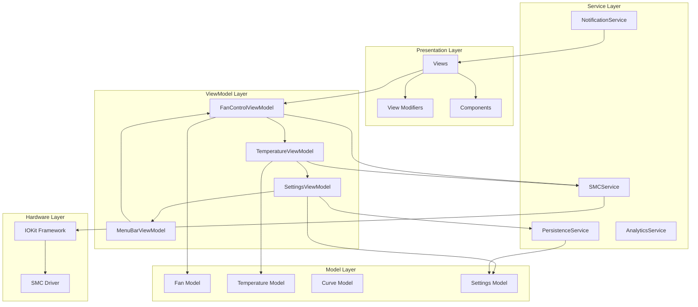
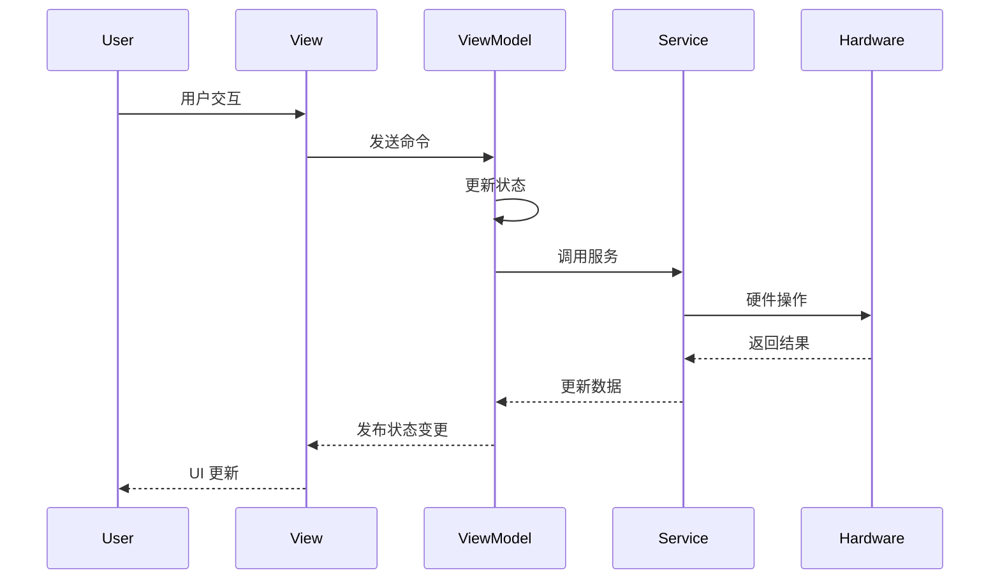

# AuraWind 架构设计文档

本文档详细描述 AuraWind 的系统架构设计，包括架构模式、组件关系、数据流、设计原则等。

---

## 📐 架构概览

AuraWind 采用 **MVVM (Model-View-ViewModel)** 架构模式，结合 SwiftUI 的声明式 UI 和 Combine 框架的响应式编程，构建一个松耦合、易测试、可维护的应用程序。

### 核心设计原则

1. **关注点分离 (Separation of Concerns)**
   - View 只负责 UI 渲染和用户交互
   - ViewModel 处理业务逻辑和状态管理
   - Model 定义数据结构
   - Service 层处理底层操作

2. **单一职责 (Single Responsibility)**
   - 每个类/模块只有一个明确的职责
   - 高内聚，低耦合

3. **依赖注入 (Dependency Injection)**
   - 使用协议定义接口
   - 通过构造函数注入依赖
   - 便于测试和替换实现

4. **响应式编程 (Reactive Programming)**
   - 使用 Combine 处理异步操作
   - 数据流驱动 UI 更新
   - 声明式状态管理

---

## 🏛️ 系统架构图

### 整体架构



### 数据流图



---

## 🔷 层次架构详解

### 1. Presentation Layer (展示层)

#### 职责
- UI 渲染和布局
- 用户交互处理
- 视觉效果展示
- 可访问性支持

#### 组件结构

```swift
// View 层次结构
AuraWindApp
├── MainWindow
│   ├── MainView
│   │   ├── NavigationSidebar
│   │   ├── DashboardView
│   │   │   ├── TemperatureCard
│   │   │   ├── FanStatusCard
│   │   │   └── QuickControlCard
│   │   ├── FanListView
│   │   │   └── FanDetailRow
│   │   └── TemperatureChartView
│   └── SettingsView
│       ├── GeneralSettings
│       ├── CurveEditor
│       ├── NotificationSettings
│       └── AdvancedSettings
└── MenuBarExtra
    ├── StatusView
    ├── QuickActionsMenu
    └── SettingsMenuItem
```

#### View 设计模式

```swift
// 基础 View 结构
struct MainView: View {
    @StateObject private var viewModel: MainViewModel
    
    var body: some View {
        NavigationSplitView {
            // Sidebar
            sidebarContent
        } detail: {
            // Detail content
            detailContent
        }
        .onAppear {
            viewModel.startMonitoring()
        }
        .onDisappear {
            viewModel.stopMonitoring()
        }
    }
}

// 可复用组件
struct LiquidGlassCard<Content: View>: View {
    let content: Content
    var style: CardStyle = .default
    
    init(@ViewBuilder content: () -> Content) {
        self.content = content()
    }
    
    var body: some View {
        content
            .modifier(LiquidGlassModifier(style: style))
    }
}
```

---

### 2. ViewModel Layer (视图模型层)

#### 职责
- 业务逻辑处理
- 状态管理
- 数据转换
- 命令处理

#### ViewModel 架构

```swift
// Base ViewModel Protocol
protocol ViewModelProtocol: ObservableObject {
    associatedtype State
    associatedtype Input
    
    var state: State { get }
    func handle(_ input: Input)
}

// ViewModel 实现示例
@MainActor
final class FanControlViewModel: ObservableObject {
    // MARK: - Published Properties
    @Published private(set) var fans: [Fan] = []
    @Published private(set) var isMonitoring: Bool = false
    @Published private(set) var currentMode: FanMode = .auto
    @Published private(set) var error: AuraWindError?
    
    // MARK: - Dependencies
    private let smcService: SMCServiceProtocol
    private let persistenceService: PersistenceServiceProtocol
    private let notificationService: NotificationServiceProtocol
    
    // MARK: - Private Properties
    private var monitoringTask: Task<Void, Never>?
    private var cancellables = Set<AnyCancellable>()
    
    // MARK: - Initialization
    init(
        smcService: SMCServiceProtocol,
        persistenceService: PersistenceServiceProtocol,
        notificationService: NotificationServiceProtocol
    ) {
        self.smcService = smcService
        self.persistenceService = persistenceService
        self.notificationService = notificationService
        
        setupBindings()
    }
    
    // MARK: - Public Methods
    func startMonitoring() {
        guard !isMonitoring else { return }
        
        isMonitoring = true
        monitoringTask = Task {
            await monitorFans()
        }
    }
    
    func stopMonitoring() {
        monitoringTask?.cancel()
        monitoringTask = nil
        isMonitoring = false
    }
    
    func setFanSpeed(fanIndex: Int, rpm: Int) async {
        do {
            try await smcService.setFanSpeed(index: fanIndex, rpm: rpm)
            await updateFanInfo(at: fanIndex)
        } catch {
            self.error = .fanControlFailed(error)
        }
    }
    
    // MARK: - Private Methods
    private func setupBindings() {
        // 设置数据绑定
    }
    
    private func monitorFans() async {
        // 监控逻辑
    }
    
    private func updateFanInfo(at index: Int) async {
        // 更新风扇信息
    }
}
```

#### State Management Pattern

```swift
// State 定义
struct FanControlState {
    var fans: [Fan]
    var mode: FanMode
    var isMonitoring: Bool
    var error: Error?
    
    static let initial = FanControlState(
        fans: [],
        mode: .auto,
        isMonitoring: false,
        error: nil
    )
}

// Input Actions
enum FanControlInput {
    case startMonitoring
    case stopMonitoring
    case setSpeed(fanIndex: Int, rpm: Int)
    case changeMode(FanMode)
    case applyProfile(CurveProfile)
}
```

---

### 3. Model Layer (模型层)

#### 职责
- 定义数据结构
- 数据验证
- 业务规则
- 序列化/反序列化

#### 核心数据模型

```swift
// Fan Model
struct Fan: Identifiable, Codable {
    let id: UUID
    var index: Int
    var name: String
    var currentSpeed: Int
    var minSpeed: Int
    var maxSpeed: Int
    var isManualControl: Bool
    
    init(
        id: UUID = UUID(),
        index: Int,
        name: String,
        currentSpeed: Int = 0,
        minSpeed: Int = 1000,
        maxSpeed: Int = 6000,
        isManualControl: Bool = false
    ) {
        self.id = id
        self.index = index
        self.name = name
        self.currentSpeed = currentSpeed
        self.minSpeed = minSpeed
        self.maxSpeed = maxSpeed
        self.isManualControl = isManualControl
    }
    
    // 业务逻辑方法
    func speedPercentage() -> Double {
        let range = Double(maxSpeed - minSpeed)
        let current = Double(currentSpeed - minSpeed)
        return (current / range) * 100
    }
    
    func isSpeedInRange(_ speed: Int) -> Bool {
        return speed >= minSpeed && speed <= maxSpeed
    }
}

// Temperature Sensor Model
struct TemperatureSensor: Identifiable, Codable {
    let id: UUID
    var type: SensorType
    var name: String
    var currentTemperature: Double
    var maxTemperature: Double
    var readings: [TemperatureReading]
    
    enum SensorType: String, Codable {
        case cpu = "CPU"
        case gpu = "GPU"
        case ambient = "Ambient"
        case proximity = "Proximity"
    }
    
    func temperaturePercentage() -> Double {
        return (currentTemperature / maxTemperature) * 100
    }
    
    func isWarning() -> Bool {
        return currentTemperature > maxTemperature * 0.85
    }
}

// Temperature Reading
struct TemperatureReading: Identifiable, Codable {
    let id: UUID
    var timestamp: Date
    var value: Double
    
    init(id: UUID = UUID(), timestamp: Date = Date(), value: Double) {
        self.id = id
        self.timestamp = timestamp
        self.value = value
    }
}

// Curve Profile Model
struct CurveProfile: Identifiable, Codable {
    let id: UUID
    var name: String
    var points: [CurvePoint]
    var isActive: Bool
    var createdAt: Date
    var updatedAt: Date
    
    struct CurvePoint: Codable {
        var temperature: Double  // 温度 (°C)
        var fanSpeed: Int        // 转速 (RPM) 或百分比
        
        init(temperature: Double, fanSpeed: Int) {
            self.temperature = temperature
            self.fanSpeed = fanSpeed
        }
    }
    
    // 插值算法
    func interpolateFanSpeed(for temperature: Double) -> Int {
        // 确保点按温度排序
        let sortedPoints = points.sorted { $0.temperature < $1.temperature }
        
        // 边界情况
        guard let first = sortedPoints.first,
              let last = sortedPoints.last else {
            return 0
        }
        
        if temperature <= first.temperature {
            return first.fanSpeed
        }
        
        if temperature >= last.temperature {
            return last.fanSpeed
        }
        
        // 线性插值
        for i in 0..<(sortedPoints.count - 1) {
            let p1 = sortedPoints[i]
            let p2 = sortedPoints[i + 1]
            
            if temperature >= p1.temperature && temperature <= p2.temperature {
                let ratio = (temperature - p1.temperature) / (p2.temperature - p1.temperature)
                let speedDiff = Double(p2.fanSpeed - p1.fanSpeed)
                let interpolatedSpeed = Double(p1.fanSpeed) + (speedDiff * ratio)
                return Int(interpolatedSpeed.rounded())
            }
        }
        
        return 0
    }
    
    // 验证曲线有效性
    func validate() -> Result<Void, CurveValidationError> {
        guard points.count >= 2 else {
            return .failure(.tooFewPoints)
        }
        
        guard points.count <= 10 else {
            return .failure(.tooManyPoints)
        }
        
        // 检查温度范围
        for point in points {
            if point.temperature < 0 || point.temperature > 120 {
                return .failure(.invalidTemperature(point.temperature))
            }
            
            if point.fanSpeed < 0 {
                return .failure(.invalidSpeed(point.fanSpeed))
            }
        }
        
        return .success(())
    }
}

enum CurveValidationError: LocalizedError {
    case tooFewPoints
    case tooManyPoints
    case invalidTemperature(Double)
    case invalidSpeed(Int)
    
    var errorDescription: String? {
        switch self {
        case .tooFewPoints:
            return "曲线至少需要 2 个点"
        case .tooManyPoints:
            return "曲线最多支持 10 个点"
        case .invalidTemperature(let temp):
            return "无效的温度值: \(temp)°C"
        case .invalidSpeed(let speed):
            return "无效的转速值: \(speed)"
        }
    }
}
```

---

### 4. Service Layer (服务层)

#### 职责
- 底层操作封装
- 外部接口集成
- 数据持久化
- 系统服务调用

#### Service 架构模式

```swift
// Service Protocol
protocol ServiceProtocol {
    associatedtype Configuration
    
    func configure(with configuration: Configuration) throws
    func start() async throws
    func stop() async
}

// SMC Service Protocol
protocol SMCServiceProtocol: ServiceProtocol {
    // 温度监控
    func readTemperature(sensor: TemperatureSensorType) async throws -> Double
    func getAllTemperatures() async throws -> [TemperatureSensor]
    
    // 风扇控制
    func getFanCount() async throws -> Int
    func getFanInfo(index: Int) async throws -> FanInfo
    func setFanSpeed(index: Int, rpm: Int) async throws
    func setFanAutoMode(index: Int) async throws
    func getFanCurrentSpeed(index: Int) async throws -> Int
    
    // 硬件监控
    func getCPUUsage() async throws -> Double
    func getGPUUsage() async throws -> Double
}

// SMC Service Implementation
final class SMCService: SMCServiceProtocol {
    typealias Configuration = SMCConfiguration
    
    // MARK: - Properties
    private var connection: io_connect_t = 0
    private var isConnected: Bool = false
    private let queue = DispatchQueue(label: "com.aurawind.smc", qos: .userInitiated)
    
    // 缓存
    private var temperatureCache: [String: CachedValue<Double>] = [:]
    private var fanInfoCache: [Int: CachedValue<FanInfo>] = [:]
    private let cacheTimeout: TimeInterval = 1.0
    
    struct CachedValue<T> {
        let value: T
        let timestamp: Date
        
        func isValid(timeout: TimeInterval) -> Bool {
            return Date().timeIntervalSince(timestamp) < timeout
        }
    }
    
    // MARK: - ServiceProtocol
    func configure(with configuration: Configuration) throws {
        // 配置服务
    }
    
    func start() async throws {
        try await openSMCConnection()
        isConnected = true
    }
    
    func stop() async {
        closeSMCConnection()
        isConnected = false
    }
    
    // MARK: - SMCServiceProtocol
    func readTemperature(sensor: TemperatureSensorType) async throws -> Double {
        // 检查缓存
        let cacheKey = sensor.rawValue
        if let cached = temperatureCache[cacheKey],
           cached.isValid(timeout: cacheTimeout) {
            return cached.value
        }
        
        // 读取温度
        let temperature = try await performSMCRead(key: sensor.smcKey)
        
        // 更新缓存
        temperatureCache[cacheKey] = CachedValue(
            value: temperature,
            timestamp: Date()
        )
        
        return temperature
    }
    
    func setFanSpeed(index: Int, rpm: Int) async throws {
        guard isConnected else {
            throw SMCError.notConnected
        }
        
        // 验证转速范围
        let fanInfo = try await getFanInfo(index: index)
        guard rpm >= fanInfo.minSpeed && rpm <= fanInfo.maxSpeed else {
            throw SMCError.invalidSpeed(rpm)
        }
        
        // 设置转速
        try await performSMCWrite(
            key: "F\(index)Tg",
            value: rpm
        )
        
        // 清除缓存
        fanInfoCache.removeValue(forKey: index)
    }
    
    // MARK: - Private Methods
    private func openSMCConnection() async throws {
        try await withCheckedThrowingContinuation { continuation in
            queue.async {
                let service = IOServiceGetMatchingService(
                    kIOMainPortDefault,
                    IOServiceMatching("AppleSMC")
                )
                
                guard service != 0 else {
                    continuation.resume(throwing: SMCError.serviceNotFound)
                    return
                }
                
                let result = IOServiceOpen(
                    service,
                    mach_task_self_,
                    0,
                    &self.connection
                )
                
                IOObjectRelease(service)
                
                if result == kIOReturnSuccess {
                    continuation.resume()
                } else {
                    continuation.resume(throwing: SMCError.connectionFailed)
                }
            }
        }
    }
    
    private func closeSMCConnection() {
        guard connection != 0 else { return }
        IOServiceClose(connection)
        connection = 0
    }
    
    private func performSMCRead(key: String) async throws -> Double {
        // SMC 读取实现
        return 0.0
    }
    
    private func performSMCWrite(key: String, value: Int) async throws {
        // SMC 写入实现
    }
}

// Persistence Service
protocol PersistenceServiceProtocol {
    func save<T: Codable>(_ object: T, forKey key: String) throws
    func load<T: Codable>(_ type: T.Type, forKey key: String) throws -> T?
    func delete(forKey key: String)
    func saveToFile<T: Codable>(_ object: T, filename: String) throws
    func loadFromFile<T: Codable>(_ type: T.Type, filename: String) throws -> T?
}

final class PersistenceService: PersistenceServiceProtocol {
    private let userDefaults: UserDefaults
    private let fileManager: FileManager
    private let encoder: JSONEncoder
    private let decoder: JSONDecoder
    
    init(
        userDefaults: UserDefaults = .standard,
        fileManager: FileManager = .default
    ) {
        self.userDefaults = userDefaults
        self.fileManager = fileManager
        self.encoder = JSONEncoder()
        self.decoder = JSONDecoder()
    }
    
    func save<T: Codable>(_ object: T, forKey key: String) throws {
        let data = try encoder.encode(object)
        userDefaults.set(data, forKey: key)
    }
    
    func load<T: Codable>(_ type: T.Type, forKey key: String) throws -> T? {
        guard let data = userDefaults.data(forKey: key) else {
            return nil
        }
        return try decoder.decode(type, from: data)
    }
    
    func delete(forKey key: String) {
        userDefaults.removeObject(forKey: key)
    }
    
    func saveToFile<T: Codable>(_ object: T, filename: String) throws {
        let url = try getDocumentDirectory().appendingPathComponent(filename)
        let data = try encoder.encode(object)
        try data.write(to: url)
    }
    
    func loadFromFile<T: Codable>(_ type: T.Type, filename: String) throws -> T? {
        let url = try getDocumentDirectory().appendingPathComponent(filename)
        guard fileManager.fileExists(atPath: url.path) else {
            return nil
        }
        let data = try Data(contentsOf: url)
        return try decoder.decode(type, from: data)
    }
    
    private func getDocumentDirectory() throws -> URL {
        guard let url = fileManager.urls(
            for: .documentDirectory,
            in: .userDomainMask
        ).first else {
            throw PersistenceError.documentDirectoryNotFound
        }
        return url
    }
}
```

---

### 5. Hardware Layer (硬件层)

#### IOKit 集成

```swift
// SMC Key Definitions
enum SMCKey {
    // Temperature Keys
    static let cpuTemp = "TC0P"
    static let gpuTemp = "TG0P"
    static let ambientTemp = "TA0P"
    
    // Fan Keys
    static func fanCount() -> String { "FNum" }
    static func fanMinSpeed(_ index: Int) -> String { "F\(index)Mn" }
    static func fanMaxSpeed(_ index: Int) -> String { "F\(index)Mx" }
    static func fanCurrentSpeed(_ index: Int) -> String { "F\(index)Ac" }
    static func fanTargetSpeed(_ index: Int) -> String { "F\(index)Tg" }
}

// SMC Data Structure
struct SMCData {
    var key: UInt32
    var dataSize: UInt32
    var dataType: UInt32
    var bytes: [UInt8]
}
```

---

## 🔄 通信模式

### View ↔ ViewModel 通信

```swift
// 1. @Published 属性驱动
class ViewModel: ObservableObject {
    @Published var state: State
}

struct ContentView: View {
    @StateObject var viewModel: ViewModel
    
    var body: some View {
        Text(viewModel.state.title)  // 自动更新
    }
}

// 2. 命令模式
extension ViewModel {
    func handleUserAction(_ action: UserAction) {
        // 处理命令
    }
}

// 3. Combine Publishers
extension ViewModel {
    var temperaturePublisher: AnyPublisher<Double, Never> {
        $temperature.eraseToAnyPublisher()
    }
}
```

### ViewModel ↔ Service 通信

```swift
// async/await 模式
class ViewModel {
    private let service: ServiceProtocol
    
    func performAction() async {
        do {
            let result = try await service.fetchData()
            await updateUI(with: result)
        } catch {
            handleError(error)
        }
    }
}

// Combine 模式
class ViewModel {
    private var cancellables = Set<AnyCancellable>()
    
    func setupBindings() {
        service.dataPublisher
            .receive(on: DispatchQueue.main)
            .sink { [weak self] data in
                self?.handleData(data)
            }
            .store(in: &cancellables)
    }
}
```

---

## 🧪 测试架构

### 测试策略

```swift
// Mock Service for Testing
class MockSMCService: SMCServiceProtocol {
    var mockTemperature: Double = 50.0
    var mockFanSpeed: Int = 2000
    var shouldThrowError: Bool = false
    
    func readTemperature(sensor: TemperatureSensorType) async throws -> Double {
        if shouldThrowError {
            throw SMCError.readFailed
        }
        return mockTemperature
    }
    
    func setFanSpeed(index: Int, rpm: Int) async throws {
        if shouldThrowError {
            throw SMCError.writeFailed
        }
        mockFanSpeed = rpm
    }
}

// ViewModel Test
@MainActor
class FanControlViewModelTests: XCTestCase {
    var sut: FanControlViewModel!
    var mockSMCService: MockSMCService!
    
    override func setUp() {
        super.setUp()
        mockSMCService = MockSMCService()
        sut = FanControlViewModel(smcService: mockSMCService)
    }
    
    func testSetFanSpeed() async throws {
        // Given
        let expectedSpeed = 3000
        
        // When
        await sut.setFanSpeed(fanIndex: 0, rpm: expectedSpeed)
        
        // Then
        XCTAssertEqual(mockSMCService.mockFanSpeed, expectedSpeed)
    }
}
```

---

## 📊 性能考虑

### 优化策略

1. **异步操作**
   - 所有 I/O 操作使用 async/await
   - 避免阻塞主线程

2. **缓存机制**
   - 温度数据缓存 1 秒
   - 风扇信息缓存 5 秒

3. **内存管理**
   - 使用 weak/unowned 避免循环引用
   - 及时取消 Combine 订阅

4. **渲染优化**
   - 使用 LazyVStack/LazyHStack
   - 避免不必要的 View 更新

---

## 🔒 安全架构

### 权限管理

```swift
// Entitlements
<key>com.apple.security.app-sandbox</key>
<true/>
<key>com.apple.security.device.usb</key>
<true/>
<key>com.apple.security.iokit-user-client-class</key>
<array>
    <string>AppleSMC</string>
</array>
```

### 数据安全

- 敏感配置使用 Keychain 存储
- 用户数据本地加密
- 不收集隐私信息

---

## 📝 设计决策记录

### ADR-001: 选择 MVVM 架构
**日期**: 2025-11-16  
**状态**: 已接受  
**背景**: 需要一个适合 SwiftUI 的架构模式  
**决策**: 采用 MVVM 架构  
**理由**: 
- 与 SwiftUI 完美配合
- 便于单元测试
- 关注点清晰分离

### ADR-002: 使用 Combine 而非 RxSwift
**日期**: 2025-11-16  
**状态**: 已接受  
**背景**: 需要响应式编程框架  
**决策**: 使用 Apple 原生的 Combine  
**理由**:
- 系统原生支持
- 与 SwiftUI 深度集成
- 无需第三方依赖

---

**文档版本**: 1.0.0  
**最后更新**: 2025-11-16  21:09
**维护者**: AuraWind Architecture Team