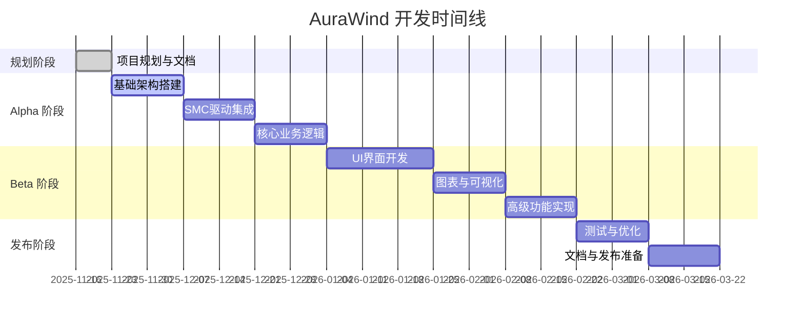

# AuraWind 项目路线图

本文档概述了 AuraWind 项目的开发计划、里程碑和长期愿景。

---

## 📅 总体时间规划

---

## 🎯 版本里程碑

### Phase 0: 项目规划 (2025-11-16 - 2025-11-22) ✅

**目标**: 完成项目前期规划和文档体系建设

#### 已完成
- ✅ 项目需求分析
- ✅ 技术架构设计
- ✅ 开发者文档编写
- ✅ 变更日志建立
- ✅ 文档目录结构创建

#### 进行中
- 🔄 项目路线图制定
- 🔄 UI 设计指南编写
- 🔄 API 接口文档编写
- 🔄 技术栈文档整理

#### 交付物
- [x] Developer Document
- [x] CHANGELOG.md
- [ ] ROADMAP.md
- [ ] Architecture.md
- [ ] UIDesignGuide.md
- [ ] APIReference.md
- [ ] TechStack.md
- [ ] CONTRIBUTING.md
- [ ] README.md

---

### Phase 1: 基础架构搭建 (2025-11-23 - 2025-12-06)

**目标**: 建立项目基础框架，实现 MVVM 架构和核心服务层

#### 核心任务

##### 1.1 项目配置 (3天)
- [ ] 配置 Xcode 项目设置
  - [ ] 设置 Deployment Target (macOS 13.0+)
  - [ ] 配置 Build Settings
  - [ ] 添加必需的 Frameworks
- [ ] 设置代码规范
  - [ ] 配置 SwiftLint
  - [ ] 创建 .swiftlint.yml
  - [ ] 定义代码风格指南
- [ ] 配置版本控制
  - [ ] 完善 .gitignore
  - [ ] 设置 Git hooks
  - [ ] 配置分支策略

##### 1.2 基础架构实现 (5天)
- [ ] MVVM 架构基础
  - [ ] 创建 BaseViewModel 协议和基类
  - [ ] 实现 Service 层协议定义
  - [ ] 设置依赖注入容器
- [ ] 数据持久化服务
  - [ ] 实现 PersistenceService
  - [ ] 配置 UserDefaults 封装
  - [ ] 实现数据序列化/反序列化
- [ ] 日志系统
  - [ ] 统一 Logger 配置
  - [ ] 实现日志级别管理
  - [ ] 添加文件日志输出

##### 1.3 测试框架搭建 (2天)
- [ ] 单元测试框架
  - [ ] 配置 XCTest
  - [ ] 创建 Mock Services
  - [ ] 编写基础测试用例示例
- [ ] UI 测试准备
  - [ ] 配置 XCUITest
  - [ ] 创建测试目标
  - [ ] 定义测试策略

#### 验收标准
- ✓ 项目可正常编译运行
- ✓ SwiftLint 通过检查
- ✓ 基础测试用例通过
- ✓ 代码覆盖率 > 80%

#### 风险与挑战
- 🔴 依赖注入容器设计复杂度
- 🟡 日志系统性能影响

---

### Phase 2: SMC 驱动集成 (2025-12-07 - 2025-12-20)

**目标**: 实现与 macOS SMC 的底层交互，建立硬件控制能力

#### 核心任务

##### 2.1 SMC Service 基础 (4天)
- [ ] IOKit 框架集成
  - [ ] 导入 IOKit Framework
  - [ ] 创建 SMC 连接管理类
  - [ ] 实现 SMC 打开/关闭操作
- [ ] 错误处理机制
  - [ ] 定义 SMCError 类型
  - [ ] 实现重试逻辑
  - [ ] 添加降级策略

##### 2.2 温度传感器读取 (4天)
- [ ] 传感器枚举
  - [ ] 发现可用温度传感器
  - [ ] 创建传感器映射表
  - [ ] 实现传感器信息读取
- [ ] 温度数据读取
  - [ ] CPU 温度读取
  - [ ] GPU 温度读取
  - [ ] 主板温度读取
  - [ ] 其他传感器支持

##### 2.3 风扇控制实现 (4天)
- [ ] 风扇检测
  - [ ] 检测风扇数量
  - [ ] 读取风扇信息（名称、最大/最小转速）
  - [ ] 获取当前转速
- [ ] 转速控制
  - [ ] 实现手动转速设置
  - [ ] 实现自动模式切换
  - [ ] 添加转速限制保护

##### 2.4 权限和安全 (2天)
- [ ] 权限配置
  - [ ] 配置 App Entitlements
  - [ ] 实现权限请求处理
  - [ ] 添加权限检查
- [ ] 安全检查
  - [ ] 输入验证
  - [ ] 边界检查
  - [ ] 异常处理

#### 验收标准
- ✓ 成功连接 SMC
- ✓ 可读取所有温度传感器
- ✓ 可控制所有风扇转速
- ✓ 错误处理完善
- ✓ 单元测试覆盖率 > 85%

#### 风险与挑战
- 🔴 不同 Mac 型号 SMC 差异
- 🔴 权限获取可能失败
- 🟡 SMC 访问稳定性

---

### Phase 3: 核心业务逻辑 (2025-12-21 - 2026-01-03)

**目标**: 实现风扇控制和温度监控的核心业务逻辑

#### 核心任务

##### 3.1 ViewModel 实现 (5天)
- [ ] FanControlViewModel
  - [ ] 风扇状态管理
  - [ ] 监控任务调度
  - [ ] 模式切换逻辑
- [ ] TemperatureMonitorViewModel
  - [ ] 实时温度监控
  - [ ] 历史数据收集
  - [ ] 图表数据生成

##### 3.2 曲线系统 (5天)
- [ ] 数据模型
  - [ ] CurveProfile 实现
  - [ ] CurvePoint 定义
  - [ ] 配置序列化
- [ ] 算法实现
  - [ ] 线性插值算法
  - [ ] 平滑过渡算法
  - [ ] 预设曲线配置
- [ ] 曲线编辑
  - [ ] 自定义曲线支持
  - [ ] 验证逻辑
  - [ ] 导入/导出功能

##### 3.3 通知系统 (2天)
- [ ] 通知服务
  - [ ] 实现 NotificationService
  - [ ] 温度警告通知
  - [ ] 风扇异常通知
- [ ] 用户交互
  - [ ] 通知响应处理
  - [ ] 快捷操作支持

#### 验收标准
- ✓ 温度-转速曲线正确工作
- ✓ 预设模式切换正常
- ✓ 通知及时准确
- ✓ 业务逻辑测试通过

---

### Phase 4: UI 界面开发 (2026-01-04 - 2026-01-24)

**目标**: 实现完整的用户界面，打造液态玻璃视觉风格

#### 核心任务

##### 4.1 液态玻璃组件库 (5天)
- [ ] 基础组件
  - [ ] LiquidGlassCard
  - [ ] GlassButton
  - [ ] GlassSlider
  - [ ] GlassToggle
- [ ] 高级组件
  - [ ] AnimatedBackground
  - [ ] GlowEffect
  - [ ] ParticleSystem

##### 4.2 主窗口界面 (7天)
- [ ] MainView 布局
  - [ ] 导航栏设计
  - [ ] 侧边栏实现
  - [ ] 主内容区
- [ ] DashboardView
  - [ ] 概览卡片
  - [ ] 实时状态显示
  - [ ] 快捷控制
- [ ] FanListView
  - [ ] 风扇列表
  - [ ] 详细信息展示
  - [ ] 控制面板

##### 4.3 设置面板 (5天)
- [ ] SettingsView 框架
  - [ ] 标签页导航
  - [ ] 设置分组
- [ ] 设置页面
  - [ ] 通用设置
  - [ ] 曲线编辑器
  - [ ] 通知设置
  - [ ] 高级选项

##### 4.4 菜单栏图标 (3天)
- [ ] MenuBarView
  - [ ] 状态图标
  - [ ] 温度显示
  - [ ] 下拉菜单
- [ ] 快捷操作
  - [ ] 一键切换模式
  - [ ] 快速设置
  - [ ] 显示主窗口

#### 验收标准
- ✓ UI 符合设计规范
- ✓ 液态玻璃效果完美
- ✓ 交互流畅自然
- ✓ 响应式布局正确
- ✓ 可访问性支持

---

### Phase 5: 图表与可视化 (2026-01-25 - 2026-02-07)

**目标**: 实现数据可视化功能，提供直观的监控体验

#### 核心任务

##### 5.1 温度图表 (4天)
- [ ] 实时曲线图
  - [ ] 多传感器支持
  - [ ] 时间范围选择
  - [ ] 缩放和平移
- [ ] 样式定制
  - [ ] 配色方案
  - [ ] 动画效果
  - [ ] 图例和标签

##### 5.2 转速图表 (3天)
- [ ] 转速显示
  - [ ] 实时转速曲线
  - [ ] 历史记录
- [ ] 关联显示
  - [ ] 温度-转速对比
  - [ ] 曲线覆盖显示

##### 5.3 性能监控 (3天)
- [ ] 系统监控
  - [ ] CPU 使用率
  - [ ] GPU 使用率
  - [ ] 内存使用
- [ ] 可视化
  - [ ] 仪表盘显示
  - [ ] 趋势图表

##### 5.4 数据导出 (2天)
- [ ] 导出功能
  - [ ] CSV 格式导出
  - [ ] 图表截图
  - [ ] PDF 报告生成

#### 验收标准
- ✓ 图表渲染流畅
- ✓ 数据更新及时
- ✓ 导出功能正常
- ✓ 性能影响可控

---

### Phase 6: 高级功能 (2026-02-08 - 2026-02-21)

**目标**: 实现智能控制和高级功能

#### 核心任务

##### 6.1 智能控制 (5天)
- [ ] 算法优化
  - [ ] 智能温控算法
  - [ ] 预测性调整
  - [ ] 场景识别
- [ ] 自适应学习
  - [ ] 使用模式分析
  - [ ] 自动参数调整

##### 6.2 性能模式 (4天)
- [ ] 预设模式
  - [ ] 静音模式
  - [ ] 平衡模式
  - [ ] 性能模式
  - [ ] 游戏模式
- [ ] 自动切换
  - [ ] 应用检测
  - [ ] 负载识别
  - [ ] 模式自动切换

##### 6.3 高级设置 (3天)
- [ ] 启动设置
  - [ ] 开机启动
  - [ ] 后台运行
- [ ] 快捷键
  - [ ] 全局快捷键
  - [ ] 自定义配置
- [ ] 主题定制
  - [ ] 颜色主题
  - [ ] 透明度调整

##### 6.4 更新系统 (2天)
- [ ] 自动更新
  - [ ] 版本检查
  - [ ] 更新下载
  - [ ] 更新安装
- [ ] 更新管理
  - [ ] 版本日志
  - [ ] 回滚支持

#### 验收标准
- ✓ 智能控制效果良好
- ✓ 模式切换流畅
- ✓ 更新功能可靠

---

### Phase 7: 测试与优化 (2026-02-22 - 2026-03-07)

**目标**: 全面测试，优化性能，确保稳定性

#### 核心任务

##### 7.1 单元测试 (4天)
- [ ] 测试覆盖
  - [ ] ViewModel 测试
  - [ ] Service 测试
  - [ ] Model 测试
- [ ] 测试完善
  - [ ] 边界测试
  - [ ] 异常测试
  - [ ] 性能测试

##### 7.2 UI 测试 (3天)
- [ ] 界面测试
  - [ ] 交互测试
  - [ ] 布局测试
  - [ ] 可访问性测试
- [ ] 兼容性测试
  - [ ] 不同分辨率
  - [ ] 深色/浅色模式

##### 7.3 性能优化 (4天)
- [ ] 性能分析
  - [ ] Instruments 分析
  - [ ] 内存泄漏检查
  - [ ] CPU 使用优化
- [ ] 优化实施
  - [ ] 内存优化
  - [ ] 启动时间优化
  - [ ] 响应速度优化

##### 7.4 稳定性测试 (3天)
- [ ] 压力测试
  - [ ] 长时间运行
  - [ ] 极端条件测试
  - [ ] 错误恢复测试
- [ ] Bug 修复
  - [ ] 收集测试反馈
  - [ ] 修复已知问题
  - [ ] 回归测试

#### 验收标准
- ✓ 测试覆盖率 > 90%
- ✓ 无已知严重 Bug
- ✓ 性能指标达标
- ✓ 稳定性测试通过

---

### Phase 8: 发布准备 (2026-03-08 - 2026-03-21)

**目标**: 完成发布前的所有准备工作

#### 核心任务

##### 8.1 用户文档 (4天)
- [ ] 文档编写
  - [ ] 用户手册
  - [ ] 快速开始指南
  - [ ] FAQ
  - [ ] 故障排除指南

##### 8.2 开发文档完善 (3天)
- [ ] 文档更新
  - [ ] API 文档补充
  - [ ] 架构图更新
  - [ ] 代码注释完善

##### 8.3 发布资源 (4天)
- [ ] App Store 准备
  - [ ] 应用图标设计
  - [ ] 截图制作
  - [ ] 应用描述
  - [ ] 宣传视频
- [ ] 法律文档
  - [ ] 隐私政策
  - [ ] 服务条款
  - [ ] 许可协议

##### 8.4 Beta 测试 (3天)
- [ ] TestFlight 配置
  - [ ] 创建测试版本
  - [ ] 邀请测试用户
- [ ] 反馈处理
  - [ ] 收集反馈
  - [ ] Bug 修复
  - [ ] 优化改进

#### 验收标准
- ✓ 文档完整准确
- ✓ 应用商店资源就绪
- ✓ Beta 测试反馈良好
- ✓ 准备好正式发布

---

## 🚀 版本发布计划

### v0.1.0 - Alpha 版本 (2026-01-31)
**内部测试版本**

#### 核心功能
- ✅ 基础 SMC 驱动支持
- ✅ 简单风扇控制
- ✅ 温度监控
- ✅ 基础 UI 界面

#### 限制
- 仅支持 2-4 个风扇
- 仅 CPU 温度监控
- 手动控制为主
- 功能有限

### v0.5.0 - Beta 版本 (2026-02-28)
**公开测试版本**

#### 新增功能
- ✅ 温度-转速曲线系统
- ✅ 图表可视化
- ✅ 预设模式
- ✅ 完整设置面板

#### 改进
- 液态玻璃 UI 完善
- 性能优化
- 错误处理增强
- 用户体验改进

### v1.0.0 - 正式版本 (2026-03-31)
**公开发布版本**

#### 完整功能
- ✅ 所有核心功能
- ✅ 完整文档和帮助
- ✅ 自动更新
- ✅ 多语言支持

#### 质量保证
- 全面测试
- 性能优化
- 稳定性增强
- 用户体验打磨

---

## 🔮 未来展望

### v1.1.0 - 功能增强 (2026 Q2)
- [ ] 更多硬件支持
- [ ] iCloud 同步
- [ ] Widgets 支持
- [ ] Shortcuts 集成

### v1.5.0 - 智能化升级 (2026 Q3)
- [ ] 机器学习优化
- [ ] 智能场景识别
- [ ] 自动化规则引擎
- [ ] 社区配置分享

### v2.0.0 - 生态系统 (2026 Q4)
- [ ] iOS/iPadOS 伴侣应用
- [ ] Apple Watch 支持
- [ ] HomeKit 集成
- [ ] 第三方插件系统

---

## 📊 成功指标

### 技术指标
- **代码质量**: SwiftLint 通过率 100%
- **测试覆盖**: 单元测试覆盖率 > 90%
- **性能**: CPU 占用 < 1%, 内存 < 50MB
- **稳定性**: 崩溃率 < 0.01%

### 用户指标
- **满意度**: App Store 评分 > 4.5
- **留存率**: 30天留存 > 60%
- **活跃度**: DAU/MAU > 40%

### 业务指标
- **下载量**: 首月 > 10,000
- **用户增长**: 月增长率 > 20%
- **社区活跃**: GitHub Stars > 500

---

## ⚠️ 风险管理

### 技术风险
| 风险 | 级别 | 缓解措施 |
|------|------|----------|
| SMC 兼容性问题 | 🔴 高 | 充分测试各型号 Mac，建立兼容性矩阵 |
| 性能影响 | 🟡 中 | 性能监控，优化算法，异步处理 |
| 权限获取失败 | 🟡 中 | 清晰的权限说明，降级方案 |
| UI 渲染性能 | 🟢 低 | 使用原生组件，避免过度动画 |

### 时间风险
| 风险 | 级别 | 缓解措施 |
|------|------|----------|
| 功能开发延期 | 🟡 中 | 预留缓冲时间，优先级管理 |
| 测试不充分 | 🟡 中 | 持续测试，自动化测试 |
| 文档滞后 | 🟢 低 | 开发同步更新文档 |

### 资源风险
| 风险 | 级别 | 缓解措施 |
|------|------|----------|
| 开发人力不足 | 🟡 中 | 合理规划，社区贡献 |
| 设计资源有限 | 🟢 低 | 使用系统设计语言 |

---

## 📝 决策记录

### 2025-11-16: 架构决策
- **决策**: 采用 MVVM 架构
- **原因**: 与 SwiftUI 完美配合，测试友好
- **影响**: 代码结构清晰，但学习曲线稍陡

### 2025-11-16: UI 框架选择
- **决策**: 使用纯 SwiftUI
- **原因**: 原生支持，性能最佳，未来兼容性好
- **影响**: 放弃部分 AppKit 特性，但整体收益大

---

## 🤝 协作流程

### 分支策略
- `main`: 稳定版本
- `develop`: 开发分支
- `feature/*`: 功能分支
- `hotfix/*`: 紧急修复

### 发布流程
1. 功能开发完成
2. 合并到 develop
3. 创建 release 分支
4. 测试和 Bug 修复
5. 合并到 main 并打标签
6. 发布到 TestFlight/App Store

---

**文档维护**: 每个阶段结束时更新进度  
**审查周期**: 每两周进行一次路线图审查  
**调整机制**: 根据实际进度灵活调整计划

---

最后更新：2025-11-16  21:07
下次审查：2025-11-30